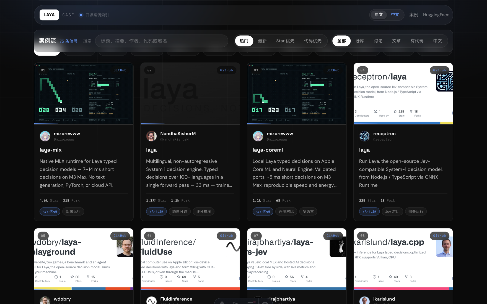

<div align="center">

# Laya Case

[](https://github.com/LearningByDoingNow/laya-case/actions/workflows/ci.yml)
[](https://learningbydoingnow.github.io/laya-case/)
[](./LICENSE)

### 🌐 [在线预览 · Live Preview](https://learningbydoingnow.github.io/laya-case/)

收集全网优秀 Laya / System 1 开源案例的收藏墙 —— 可搜索、可筛选、可复制运行
A curated wall of open-source Laya / System 1 cases — searchable, filterable, runnable



**简体中文** · [English](#english)

</div>

> 非官方社区项目,与 Convai Innovations / Laya 无隶属关系;模型、代码片段、账号信息与商标权利归原作者及原平台所有。

## 特性

| | 说明 |
|---|---|
| **全来源收录** | GitHub 仓库、HuggingFace 模型与 Space、Reddit 讨论、博客文章,一墙尽览 |
| **搜索与筛选** | 关键词搜索,来源与用途标签筛选,支持热门 / 最新 / Star / 代码优先排序 |
| **中英双语** | 界面中文优先,英文案例附中文参考,详情页原文对照 |
| **可运行代码** | 详情页内嵌代码片段,一键复制 |
| **真实封面** | 每条案例使用各平台官方画面:仓库社交卡、模型卡缩略图、文章配图、帖子预览 |
| **定时保鲜** | 每周一自动采集合并;单来源失败不阻断,空结果不覆盖 |
| **纯静态** | Astro 静态生成,canonical / Open Graph / JSON-LD 齐全,适配桌面与移动端 |

## 技术栈

| 层 | 选型 |
|---|---|
| 静态站点 | Astro |
| 交互组件 | React |
| 样式 | 原生 CSS |
| 数据管道 | Node.js 采集与合并脚本 |
| 测试 | Playwright 桌面 + 移动端冒烟测试 |

## 快速开始

```bash
npm install
npm run dev
```

开发服务器运行在 <http://localhost:4321/laya-case/>,与线上使用完全相同的 `/laya-case/` 子路径。

```bash
npm run check   # 类型检查
npm run build   # 静态构建 → dist/
```

推送到 `main` 后由 GitHub Actions 自动检查、构建并发布到 **[在线预览](https://learningbydoingnow.github.io/laya-case/)**。`base` 固定为 `/laya-case/`(见 `astro.config.mjs`),本地、测试与线上运行在完全相同的子路径,产物逐字节一致。

## 数据

```bash
npm run data:fetch                    # 采集 GitHub / HuggingFace / Reddit / 博客,末尾自动补封面
npm run data:fetch -- --only=github   # 只采集部分来源
npm run data:covers                   # 单独补齐缺失封面并修复死图
npm run data:build                    # 合并 auto + manual → src/data/cases.json
```

- 自动采集输出到 `src/data/auto/*.json`;手动精选放在 `src/data/manual/*.json`(X、知乎等无公开 API 的来源),同 URL 时 manual 覆盖 auto
- `src/data/cases.json` 由合并脚本生成,请勿手改
- 封面策略:GitHub 取仓库社交卡、HuggingFace 取官方缩略图、文章与帖子取 og:image 与预览图;知乎与掘金因反爬跳过
- 无 `GITHUB_TOKEN` 时 GitHub 搜索限 10 次/分,配置后配额提升
- 英文来源默认 `translation.status: "pending"`,中文参考由人工或后续翻译流程补充
- `refresh-data.yml` 每周一 03:00 UTC 定时采集合并,支持手动触发;案例数低于 60 条时中止发布;数据有变化才由 `github-actions[bot]` 提交并触发部署

### 案例结构

`schemaVersion: 1`,每条案例包含:

- `sourceType`:github / huggingface / reddit / x / threads / blog / video / official
- `title`、`excerpt`、`author`、`canonicalUrl`、`createdAt`、`lang`
- `translation`:中文参考(ready / pending)
- `code`:可运行代码片段(语言 + 源码)
- `metrics`:stars / forks / upvotes / comments / likes / views(按来源取用)
- `tags`:用途标签;`variants`:用到的 Laya 变体或运行时
- `links`、`imageUrl`、`curatedAt`、`curatedBy`

### 站点域名

构建时通过环境变量注入公开 origin,用于 canonical 与分享元数据;`/laya-case/` 子路径固定在 `astro.config.mjs` 的 `base`。CI 自动注入,本地等效命令:

```bash
PUBLIC_SITE_URL=<站点域名> npm run build
```

## 测试

```bash
npm run test:smoke                          # 本地(需 dev server 运行中)
TEST_ORIGIN=<线上域名> npm run test:smoke    # 对线上部署执行同一套测试
```

测试默认使用本机 Chrome。

## 致谢

- 代码结构基于 [Jev-Case](https://github.com/Hiwoniu/Jev-Case)(MIT License),感谢 Hiwoniu
- Laya 模型与权重归 [Convai Innovations](https://huggingface.co/convaiinnovations) 所有(Apache 2.0)

## 许可

代码使用 [MIT License](./LICENSE)(继承自 Jev-Case)。推文、文章、代码片段、账号信息与商标权利归原作者及原平台所有;本项目仅整理公开来源并保留原链接。

---

## English

**[🌐 Live Preview](https://learningbydoingnow.github.io/laya-case/)** · [简体中文](#laya-case)

Laya Case gathers publicly shared Laya use cases from GitHub, HuggingFace, Reddit and blogs into one static wall — source links, authors, metrics, runnable code and external links preserved.

> Unofficial community project, not affiliated with Convai Innovations / Laya. Models, snippets, accounts and trademarks belong to their original authors and platforms.

### Features

| | Description |
|---|---|
| **Every source** | GitHub repos, HuggingFace models and spaces, Reddit threads, blog posts |
| **Search & filters** | Full-text search, source and tag filters, hot / new / stars / code-first sorting |
| **Bilingual UI** | Chinese-first interface; English cases carry a Chinese reference |
| **Runnable code** | Snippets on every detail page, one click to copy |
| **Real covers** | Each case uses its platform's own art: repo social card, model card, article image, post preview |
| **Fresh data** | Every Monday the pipeline re-collects and merges; one failing source never blocks the run |
| **Static** | Astro output with canonical / Open Graph / JSON-LD; desktop and mobile layouts |

### Getting Started

```bash
npm install
npm run dev        # http://localhost:4321/laya-case/
npm run check      # type check
npm run build      # static build → dist/
```

Pushing to `main` builds and deploys via GitHub Actions to the **[Live Preview](https://learningbydoingnow.github.io/laya-case/)**. The `base` is pinned to `/laya-case/`, so local, tests and production share the identical subpath and produce byte-identical output.

### Data

```bash
npm run data:fetch     # collect all sources (covers backfilled at the end)
npm run data:covers    # backfill missing covers and repair dead ones
npm run data:build     # merge auto + manual → src/data/cases.json
```

- Collection output: `src/data/auto/*.json`; hand-picked entries: `src/data/manual/*.json` (manual wins on the same URL)
- `src/data/cases.json` is generated — never edit it by hand
- Covers: GitHub repo social cards, HuggingFace thumbnails, og:image and feed images for blogs and posts; Zhihu and Juejin are skipped as they block collectors
- Scheduled refresh every Monday 03:00 UTC: a failing source never blocks, empty results keep the existing file, below 60 cases aborts the publish

### Test

```bash
npm run test:smoke                            # local (dev server running)
TEST_ORIGIN=<live-origin> npm run test:smoke  # same suite against production
```

### Credits & License

- Structure based on [Jev-Case](https://github.com/Hiwoniu/Jev-Case) (MIT) — thanks Hiwoniu
- Laya models and weights belong to [Convai Innovations](https://huggingface.co/convaiinnovations) (Apache 2.0)
- Code licensed under the [MIT License](./LICENSE); content rights remain with the original authors and platforms
